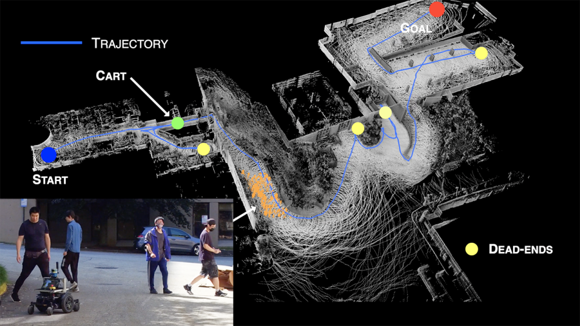
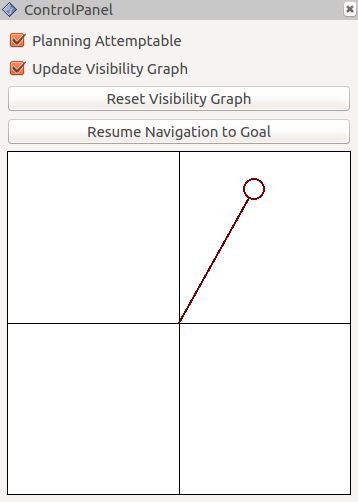
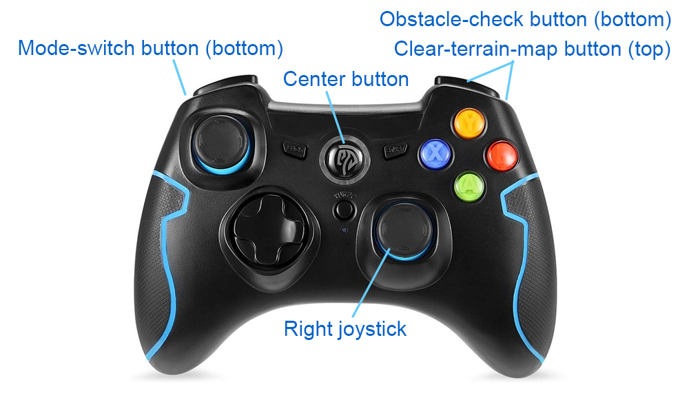

FAR Planner uses a dynamically updated visibility graph for fast replanning. The planner models the environment with polygons and builds a global visibility graph along with the navigation. The planner is capable of handling both known and unknown environments. In a known environment, paths are planned based on a prior map. In an unknown environment, multiple paths are attempted to guide the vehicle to goal based on the environment observed during the navigation. When dynamic obstacles are present, FAR Planner disconnects visibility edges blocked by the dynamic obstacles and reconnects them after regaining visibility. The software implementation uses two CPU threads - one for dynamically updating the visibility graph using ~20% of the thread and the other for path search that can find a path within 3ms, as evaluated on an i7 computer.

FAR Planner was used by the [CMU-OSU Team](https://www.subt-explorer.com) in attending [DARPA Subterranean Challenge](https://www.subtchallenge.com). In the final competition which took place in Louisville Mega Cavern, KY, the team's robots conducted the most complete traversing and mapping across the site (26 out of 28 sectors) among all teams, winning a "Most Sectors Explored Award".

[A video showing functionalities of FAR Planner is available.](https://youtu.be/5shnlyZ4L9M)

<p align="center">
  
</p>

## Usage

The repository has been tested in Ubuntu 18.04 with ROS Melodic and Ubuntu 20.04 with ROS Noetic. Follow instructions in [Autonomous Exploration Development Environment](http://cmu-exploration.com) to setup the development environment. Make sure to checkout the branch that matches the computer setup, compile, and download the simulation environments.

To setup FAR Planner, clone the repository.
```
git clone https://github.com/MichaelFYang/far_planner
```
In a terminal, go to the folder and compile.
```
cd far_planner
catkin_make
```
To run the code, go to the development environment folder in a terminal, source the ROS workspace, and launch.
```
source devel/setup.sh
roslaunch vehicle_simulator system_indoor.launch
```
In another terminal, go to the FAR Planner folder, source the ROS workspace, and launch.
```
source devel/setup.sh
roslaunch far_planner far_planner.launch
```
Now, users can send a goal by pressing the 'Goalpoint' button in RVIZ and then clicking a point to set the goal. The vehicle will navigate to the goal and build a visibility graph (in cyan) along the way. Areas covered by the visibility graph become free space. When navigating in free space, the planner uses the built visibility graph, and when navigating in unknown space, the planner attempts to discover a way to the goal. By pressing the 'Reset Visibility Graph' button, the planner will reinitialize the visibility graph. By unchecking the 'Planning Attemptable' checkbox, the planner will first try to find a path through the free space. The path will show in green. If such a path does not exist, the planner will consider unknown space together. The path will show in blue. By unchecking the 'Update Visibility Graph' checkbox, the planner will stop updating the visibility graph. To read/save the visibility graph from/to a file, press the 'Read'/'Save' button. An example visibility graph file for indoor environment is available at 'src/far_planner/data/indoor.vgh'.

<p align="center">
  
</p>

Anytime during the navigation, users can use the control panel to navigate the vehicle by clicking the in the black box. The system will switch to *smart joystick* mode - the vehicle tries to follow the virtual joystick command and avoid collisions at the same time. To resume FAR Planner navigation, press the 'Resume Navigation to Goal' button or use the 'Goalpoint' button to set a new goal. Note that users can use a PS3/4 or Xbox controller instead of the virtual joystick. For more information, please refer to our development environment page.

<p align="center">
  
  &nbsp;&nbsp;&nbsp;
  
</p>

To launch with a different environment, use the command lines below and replace '\<environment\>' with one of the environment names in the development environment, i.e. 'campus', 'indoor', 'garage', 'tunnel', and 'forest'. Note that when running in campus environment, set *checkTerrainConn* to true in system_campus.launch in the 'src/vehicle_simulator/launch' folder of the development environment.
```
roslaunch vehicle_simulator system_<environment>.launch
roslaunch far_planner far_planner.launch
```
To run FAR Planner in a [Matterport3D](https://niessner.github.io/Matterport) environment, follow instructions on the development environment page to setup the Matterport3D environment. Then, use the command lines below to launch the system and FAR Planner.
```
roslaunch vehicle_simulator system_matterport.launch
roslaunch far_planner far_planner.launch config:=matterport
```

<p align="center">
  
</p>

Users have the option to define custom navigation boundaries. To do this, users need to supply a boundary file and a trajectory file. Examples are provided as 'boundary.ply' and 'trajectory.txt' in the 'src/far_planner/data' folder. The files can be viewed by text editors. Specifically, the boundary file contains user-defined polygons where each polygon has an index. The trajectory file contains poses where each pose is a row with x (m), y (m), z (m), roll (rad), pitch (rad), yaw (rad), and time duration from start of the run (second). The trajectory file is in the same format as those saved by the development environment and needs to contain at least one pose to determine the traversable side of the navigation boundaries. Users can use the command line below to generate a visibility graph file in the same folder (provided as 'boundary_graph.vgh'), which can be loaded to FAR Planner using the 'Read' button.
```
roslaunch boundary_handler boundary_handler.launch
```

## Configuration

FAR Planner settings are kept in default.yaml in the 'src/far_planner/config' folder. For Matterport3D environments, the settings are in matterport.yaml in the same folder.
- *is_static_env* (default: true) - set to false if the environment contains dynamic obstacles.
- *is_attempt_autoswitch* (default: true) - set to false to turn off auto switch from non-attemptable navigation (for known environment) to attemptable navigation (for unknown environment).
- *is_viewpoint_extend* (default: true) - set to false to stop extending visibility graph vertices away from objects to gain better viewpoints.
- *is_pub_boundary* (default: false) - set to true to send custom navigation boundaries to the local planner in the development environment.

## Reference

- F. Yang, C. Cao, H. Zhu, J. Oh, and J. Zhang. FAR Planner: Fast, Attemptable Route Planner using Dynamic Visibility Update. IEEE/RSJ Intl. Conf. on Intelligent Robots and Systems (IROS). Kyoto, Japan, Oct. 2022. **Best Student Paper Award.**

## Author

[Fan Yang](https://github.com/MichaelFYang) (michael.yfan24@gmail.com)
